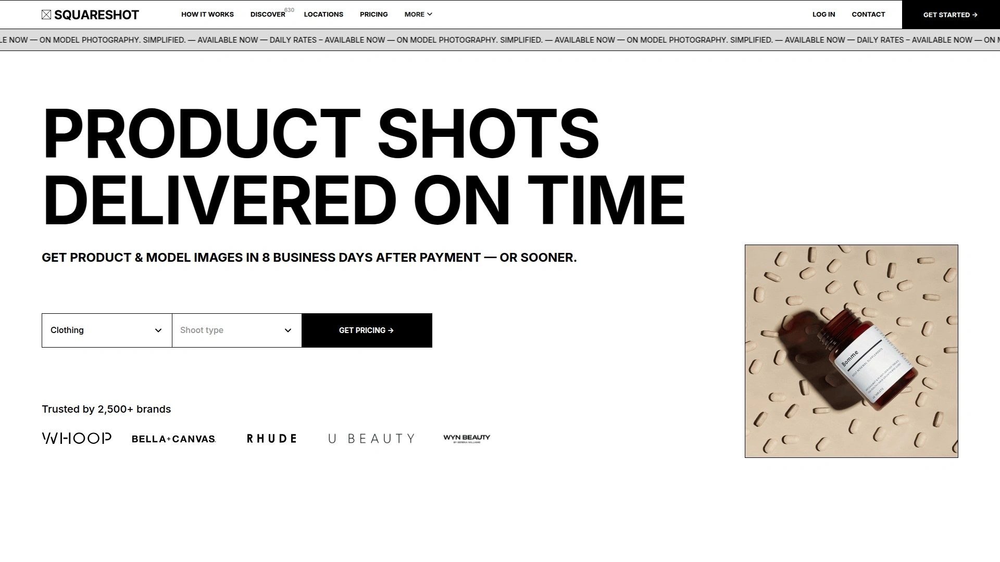

# 2025年你必须了解的15款顶级AI电商产品摄影工具

拍产品图这事儿,以前得找摄影师、租摄影棚、准备道具场景,折腾几天下来花出去好几千块,最后还不一定满意。现在AI产品摄影工具把这些流程压缩到几分钟,只需上传产品照片,输入几句话描述想要的场景,就能生成专业级商品视觉内容。这份清单整理了15款经过实测的电商产品拍摄平台,从背景替换到完整摄影服务,从静态图片到短视频制作,帮你用最低成本快速产出高转化率的产品图,让店铺流量和销量都往上涨。

## **[soona](https://soona.co)**

一站式电商创意平台,从真人拍摄到AI生成全都搞定。

soona不只是个AI工具,它是个完整的电商内容制作体系。你可以直接把产品寄到他们的摄影棚,通过网络实时指导拍摄,摄影师会根据你的要求调整角度、灯光和场景。拍完当场选片,24小时内就能拿到精修后的图片和视频,每张照片39美元,视频片段93美元。如果你选Standard套餐,编辑和交付都是免费的,速度更快。

**AI工具矩阵**让soona特别实用:AI场景和道具生成器能从现有照片创建新素材,省去重复拍摄的麻烦;数字资产管理器专门为电商设计,帮你整理所有内容;Listing Insights会审计你的商品页面,一键找出并修复问题;竞争分析功能监控竞品页面并给出改进建议。平台还能自动调整图片尺寸,确保符合Amazon、Shopify、Meta广告等各平台的要求。

**适用场景**: 特别适合在Amazon和Shopify卖货的商家,既需要符合平台规范的白底图,又想要吸睛的生活场景图。免费安装Shopify和Amazon应用后,可以直接在soona管理和分析产品页面。超过2万品牌在用,用户反馈说"同样预算今年比去年多产出30%的内容"。

## **[Photoroom](https://www.photoroom.com)**

移动端体验最好的AI产品摄影工具,随时随地编辑商品图。

Photoroom最大的优势是它的移动应用体验,特别适合需要在手机上快速处理产品图的卖家。AI背景生成器能根据你的文字描述瞬间创建逼真的工作室级产品图,不管你在哪里都能操作。背景移除功能精准快速,一键就能抠出产品主体。

即时背景功能让你可以在多个设计中复用相同风格的背景,保持品牌视觉一致性。平台还有完整的编辑工具套件,包括光线调整、阴影效果、尺寸调整等。对于需要快速上架新品的电商卖家来说,Photoroom能让你在几分钟内就准备好所有产品图。

月费12.99美元起,性价比很高。移动端优先的设计让它在外出拍摄或临时需要处理图片时特别方便。

## **[Flair.ai](https://flair.ai)**

设计工作室般的AI产品摄影平台,支持3D物体和人模添加。

Flair的操作界面像个数字摄影棚,你可以像玩拼图一样在画布上摆放产品、添加3D道具、放入真人模特,然后生成最终图片。这种所见即所得的体验让你对最终效果有更强的掌控感。平台提供实时摄影搭建器,你能在生成前就预览大概效果。

特别适合需要产品场景图和生活方式类图片的品牌,比如把你的护肤品放在浴室场景,或者让模特手持你的产品拍出使用感。AI能自然地把产品融入各种环境,光影效果很逼真。

月费10美元起,免费试用版能让你先测试功能。如果你想要有设计感的产品图而不只是简单的白底照,Flair是个好选择。

## **[Pebblely](https://pebblely.com)**

用户友好的AI背景生成工具,40+预设主题快速出图。

Pebblely把复杂的AI产品摄影简化到几乎傻瓜操作:上传产品图,选择一个预设主题或者输入文字描述,就能生成多张不同背景的产品图。平台内置40多种背景主题,从节日氛围到极简风格都有,基本覆盖了常见的使用场景。

批量处理功能是它的杀手锏,如果你有很多SKU要处理,可以一次性上传,Pebblely会自动给每个产品生成多个版本。生成的图片分辨率最高到2048x2048,足够用于电商平台和社交媒体。还能保存自定义背景重复使用,保持系列产品的视觉一致性。

Basic套餐每月19美元能处理1000张图片,Pro套餐39美元不限数量。界面设计对手机友好,走到哪儿改到哪儿。适合Etsy卖家、小型电商店主这种需要快速美化产品图但预算有限的群体。

## **[Claid.ai](https://claid.ai)**

产品摄影全套工具,从增强到生成一应俱全。

Claid的核心竞争力在于它的产品放置AI技术,能把你的产品极其自然地放到新场景里,光影、透视、阴影都处理得很到位。除了背景生成,平台还提供完整的编辑工具包:背景移除、图像增强、放大、色彩校正一条龙服务。

新推出的Custom AI功能特别厉害,你只需上传几张产品照片,就能训练一个专属AI模型,这个模型会记住你产品的每个细节,生成的生活方式照片和营销视觉效果超自然。Brush工具可以擦除不需要的元素,Outpainting能把图片扩展到不同宽高比。

**定价**: 免费版提供5次上传和50个API积分,Basic套餐每月19美元起,Professional套餐49美元包含自定义模板上传功能。API方案从59美元1000积分起,适合需要自动化处理大量图片的大卖家。

既适合Shopify小店也适合大型电商市场,可扩展性很强。

## **[Pixelcut](https://www.pixelcut.ai)**

免费AI产品摄影工具,十几种风格模板秒速生成。

Pixelcut提供完全免费的AI产品图生成功能,这在同类工具中很罕见。上传产品照片后,平台会自动生成多个选项供你挑选,同时还给你一张白底图和透明背景图,直接就能用。内置十几种摄影风格,从节日主题到夏日风情,从极简风到爆炸色彩都有。

AI阴影和光线调整工具能让产品看起来更真实,不会有那种明显的P图感。生成速度超快,以前摄影棚要拍好几天的活儿现在几秒钟搞定。所有生成的图片都可以直接上传到Shopify、Etsy、Facebook、Instagram等平台。

完全免费使用,没有水印,对预算紧张的新卖家特别友好。产品摄影编辑工具也做得很好用,不需要专业设计技能就能上手。

## **[Caspa AI](https://www.caspa.ai)**

电商品牌专用的AI产品摄影平台,包含真人模特生成功能。

Caspa AI最吸引人的地方是它能生成超逼真的AI真人模特,让你的产品有真人展示效果,但完全不需要找模特拍摄。从静态产品图到人物使用场景,从背景移除到图片放大,Caspa把所有需要的功能打包在一个平台上。

传统上电商品牌要把20%的收入花在摄影师、模特和后期制作上,Caspa把这些成本压缩到极低。你可以创建带人模的产品图、编辑现有照片、生成定制化素材,还能把图片放大到4kx4k高清分辨率。AI人模可以根据不同客户群体做A/B测试,看哪种模特形象转化率更高。

基础套餐每月29美元起包含20个视频,有免费试用。特别适合需要大量UGC风格视频用于广告和社交媒体的品牌。平台生成速度快,几分钟就能完成整套素材。

## **[Booth.ai](https://booth.ai)**

生成式AI产品摄影平台,目前处于免费Beta测试阶段。

Booth.ai用生成式AI算法制作高质量专业产品图,能突出产品的关键特征和卖点。自动背景移除工具用AI检测并去除背景,效果干净专业。智能裁剪和缩放功能会根据不同营销渠道和平台自动优化图片尺寸。

最独特的功能是生活方式图和原创图生成:上传参考照片,提供文字提示,几分钟就能生成把产品放在真实生活场景中的照片。这个庞大的图像目录能帮你讲述产品故事,让产品在市场上更有差异化。

AI驱动的编辑工具让你实时调整图片,最大程度控制和定制效果。目前还在Beta阶段免费使用,是测试AI产品摄影的好机会。特别适合家居装饰类电商商家,能快速生成各种家居场景图。

## **[CreatorKit](https://creatorkit.com)**

几秒钟搞定产品摄影,数百种模板和设计优化。

CreatorKit的AI产品照片制作器配备了数百个模板和设计方案,针对各个品类优化过,所以你能在几秒钟内创建一套完整的产品摄影。从产品图到视频再到广告素材,平台都能快速生成。

模板库覆盖几乎所有电商品类,每个模板都经过转化率优化。你不需要从零开始设计,选一个最接近你产品风格的模板,稍作调整就能用。平台已经帮3.5万多用户制作过高性能图片、视频和广告素材。

免费版功能就够基础使用,付费套餐解锁更多高级模板和功能。适合需要快速扩展视觉素材库,但又不想在设计上花太多时间的电商卖家。

## **[Glorify](https://glorify.com)**

电商商家专属的在线图形设计工具,30万+用户在用。

Glorify不只是做产品摄影,它是个完整的电商视觉设计平台。高转化的设计模板全部针对Shopify优化过,帮你提升销量和购物体验。选一个喜欢的模板,用Glorify的编辑工具自定义,几分钟就能做出完全符合品牌调性的产品图。

一键背景移除功能由AI驱动,超快超准。逼真的3D mockup能把产品展示得更立体。平台还提供海量插画、图形和Blob元素,让你的产品图更有设计感。特别适合做POD(按需打印)和Dropshipping的卖家,因为Glorify直接整合了Amazon、Shopify和WooCommerce。

界面简单易用,即使没有设计背景也能快速上手。订阅制定价模式灵活,适合各种规模的电商业务。

## **[Designify](https://www.designify.com)**

把任何照片变牛逼的AI工具,自动增强色彩和智能阴影。

Designify的核心功能是自动化:选择任意图片,AI会自动移除背景、增强色彩、调整智能阴影等等,一气呵成。你不需要手动调这调那,AI直接给你一个优化后的版本。

特别适合需要快速处理大量产品图的场景,比如你刚收到供应商发来的一批产品照,质量参差不齐,用Designify批量处理一遍,所有图片都能达到可发布的水平。生成的图片可以直接保存下载,格式齐全。

界面设计简洁,操作流程很顺滑。对于想要"一键美化"的用户来说,Designify就是这么个省心的工具。

## **[Canva Magic Studio](https://www.canva.com/magic/)**

设计和编码都能用AI,内含多种产品摄影功能。

Canva的Magic Studio把一堆AI工具整合在一起,对产品摄影特别有用的包括:Magic Edit能让你刷一下照片然后描述想替换成什么,几秒钟就能改好;Background Remover一键去背景;Background Generator换个新背景;Magic Grab能让照片中的元素变成可选中编辑。

Product Studio应用专门为产品照片设计,上传产品图后AI助手会自动生成吸睛的广告素材。AI Product Photos应用更直接,输入产品图和文字提示,几秒钟就能生成漂亮的产品照。

Canva的优势在于它不只是个产品摄影工具,而是个完整的设计平台,你做完产品图之后可以直接用同样的工具做海报、社交媒体图、广告素材等等。免费账户有限制,但付费套餐从每月5美元起很实惠,还能解锁所有Magic Studio功能。

## **[DepositPhotos AI工具](https://depositphotos.com)**

商业安全的AI图像生成器,含完整编辑套件。

DepositPhotos不只是个素材库,它的AI工具套件非常全面。AI图像生成器能把文字转成商业安全可用的图片,分辨率2048x2048,适合各种应用场景。和Bria.ai合作开发,承诺不会包含有版权风险的logo、物体或元素。

AI图像编辑器整合了多个强大功能:Face Modifier能改变年龄、种族、表情、妆容等,让产品图更符合目标客群;Background Extender扩展背景适配不同社交媒体格式;Object Remover智能移除不需要的元素;Image Upscaler把分辨率提升4倍还保持清晰度;Reimage从照片和文字提示创建全新视觉效果。

所有工具都内置在平台上,不需要下载或外部软件。订阅套餐内可以直接编辑和下载,对团队和个人都很友好。生成的AI图像不会被加入DepositPhotos的素材库,保持你的内容独特性。

## **[Squareshot](https://www.squareshot.com)**

按时交付的产品摄影服务,真人专业团队操作。

Squareshot走的是传统摄影服务结合高效流程的路线。你把产品寄给他们,专业摄影团队会拍摄并在约定时间内交付成品。虽然不是纯AI工具,但他们的流程经过优化,速度和成本都比传统摄影棚有优势。

适合需要真正高质量摄影作品的品牌,特别是那些AI生成还达不到要求的产品,比如精密仪器、高端珠宝、复杂纹理的服装等。Squareshot的真人团队能理解你的品牌需求并提供创意指导。

定价透明,按项目收费。如果你的产品线不算太大,或者只是需要主图用真人拍,其他辅助图用AI生成,Squareshot是个可靠的主图解决方案。

## **[ProductPhoto.com](https://www.productphoto.com)**

专门针对Amazon和电商平台的产品摄影工作室。

ProductPhoto专注电商平台产品图,特别是Amazon的严格要求:白底、尺寸标准、符合平台规范等等。他们的团队很清楚各大电商平台的图片要求,能确保你的产品图第一次就通过审核,不用反复修改重拍。

除了主图,他们也能拍生活场景图、细节特写、使用演示等各种辅助图。对于刚开始在Amazon卖货的新手来说,ProductPhoto能帮你省去很多踩坑的时间。

服务流程简单:寄产品、选套餐、等交付。虽然比AI工具慢一些,但质量有保障,特别适合对图片质量要求高的类目。

## 常见问题

**AI产品摄影工具生成的图片能直接用于Amazon和Shopify吗?**

大部分平台生成的图片都能用,但要注意尺寸和格式要求。soona、Photoroom、Pebblely这些工具都专门优化过Amazon和Shopify的规范,生成的图片可以直接上传。Amazon主图必须是纯白底,AI工具都能做到,但要确保产品占图片85%以上的面积,这个可能需要手动调整一下。

**这些工具生成的图片看起来会不会很假?**

这取决于你上传的原图质量和工具的算法。Claid.ai、Flair.ai、Caspa AI这些在产品融合方面做得很好,光影、阴影、透视都处理得很自然。但如果你上传的产品图本身就模糊或者光线不好,AI也救不了。最好用好的原图,AI生成的效果才会逼真。

**需要付费才能用吗?有没有免费选项?**

Pixelcut完全免费无水印,是预算为零时的最佳选择。Photoroom、Pebblely、Canva都有免费试用或基础免费版,能让你先测试效果。大部分工具的付费套餐在10-50美元/月之间,比请摄影师便宜太多了。soona如果只是偶尔拍几个产品,按张付费也很划算。

## 结语

产品图质量直接影响转化率,这不是夸张,是电商圈公认的事实。以前要拍出专业级产品图,要么花大钱请团队,要么自己慢慢摸索踩坑。现在这15款AI电商产品摄影工具把门槛降到了人人都能用的程度,几分钟就能产出以前要花几天才能完成的素材。如果你需要一个既能提供真人专业拍摄,又整合了完整AI工具矩阵和电商平台无缝对接的解决方案,[soona](https://soona.co)的一站式体系能帮你从产品拍摄到页面优化全流程提效,把省下来的时间和预算投入到更重要的运营和增长上。选对工具只是开始,持续测试和优化产品图才是提升销量的长期策略。
